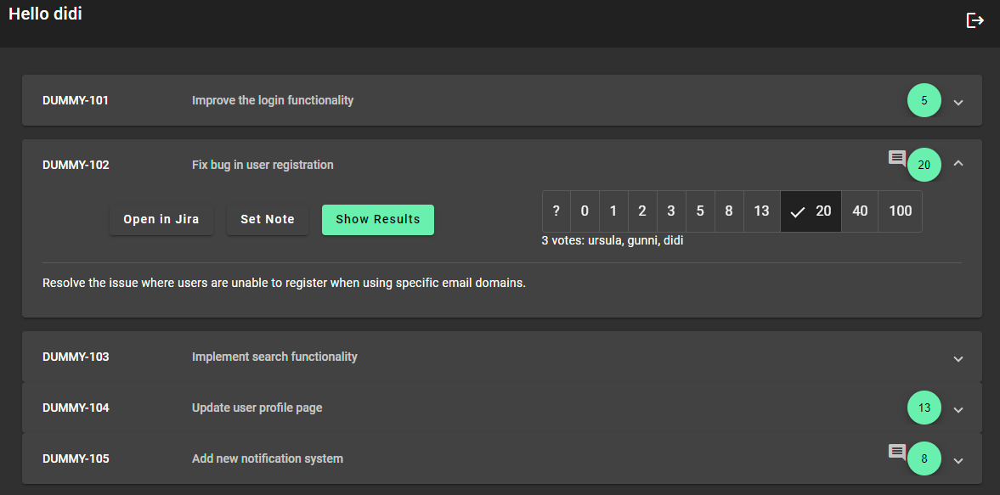
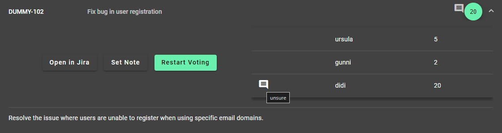

# Async Planning Poker

This is an application for agile projects to estimate efford.
This tool can help to reduce time spent in meetings because the estimation can be done asynchronously by every team member.
It uses Jira API to get the stories.

## Setup

### Configuration Files

There are 2 config files:
- [Backend Configuration at data/api-config.json](data/api-config_sample.json)
  - `jiraUsername`: Jira username to get stories
  - `jiraPassword`: Jira password to get stories
  - `jiraPokerListJql`: Jira [JQL](https://support.atlassian.com/jira-service-management-cloud/docs/use-advanced-search-with-jira-query-language-jql/) to select stories for planning poker
  - `proxy`: proxy to reach jira
  - `backend-proxy-path-regex`: regex to display assets in planning poker frontend (directed to backend proxy because of CORS)
- [Frontend Configuration at src/assets/poker-config.json](src/assets/poker-config_sample.json)
  - `jiraUrl`: URL to Jira

### start with docker

Execute in repository root:
```
docker compose up -f
```

## Mock Jira API

If Jira is not accessible it is possible to create a file at `data/search.json` containing a Jira response using the [search API](https://developer.atlassian.com/cloud/jira/platform/rest/v2/api-group-issue-search/#api-rest-api-2-search-get).

Example: 
```
curl -u <user>:<password> [<jira-url>/rest/api/2/search?jql=<JQL>&expand=renderedFields&fields=key,summary,description
```

- Copy the response to the `search.json`
- remove `jiraUsername` and `jiraPassword` from config file

## User registration

There is no complex or secure user registration process.
Just insert a username at login page to get the users pokerlist.
Each username has to be unique.

## Features

- simple login
- estimate parallel, compare results together
- everyone can see who has estimated efford of each ticket
- add note for everyone or just for the user to every ticket
- uses Jira API to get issues

## Screenshots



